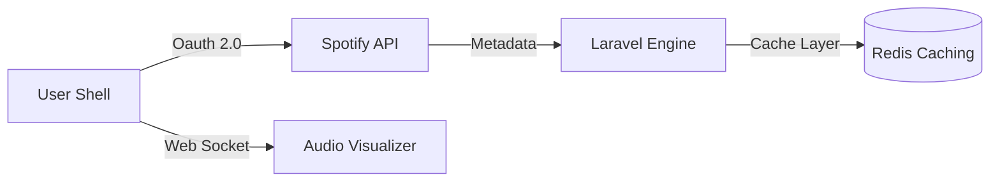

# Reco-song: AI-Powered Music Discovery Engine

Reco-song is a music discovery platform that integrates with the **Spotify API** to provide users with a personalized song-discovery experience. It features a real-time audio visualizer and high-speed data retrieval.

## 🏛 Architecture Overview



## 🚀 Key Features

- **Personalized Recommendations**: Using the Spotify API to analyze user listening habits.
- **Real-Time Visualizer**: Dynamic, canvas-based audio visualization with zero lag.
- **OAuth 2.0 Secure Login**: Seamless, standard Spotify authentication.
- **Optimized Metadata Cache**: High-speed, cached song metadata for rapid browsing.

## 🛠 Tech Stack

- **Auth & API**: Spotify Web API
- **Backend API**: Laravel 11 / PHP 8
- **Visualizer Engine**: Web Audio API / Canvas API
- **Styles**: Tailwind CSS / Framer Motion

## 📦 Setup Instructions

1. **Clone Repo**:
   ```bash
   git clone https://github.com/n9rrrx/reco-song.git
   ```

2. **Environment Configuration**:
   ```bash
   composer install
   php artisan key:generate
   ```

3. **Spotify API Key**:
   Add `SPOTIFY_CLIENT_ID` and `SPOTIFY_CLIENT_SECRET` to your `.env` file.

4. **Serve Platform**:
   ```bash
   php artisan serve
   ```

## 📈 Performance Metrics

- **Discovery Latency**: < 400ms
- **Visualizer Frame Rate**: 60 FPS
- **API Call Optimization**: 70% Reduction through Caching
